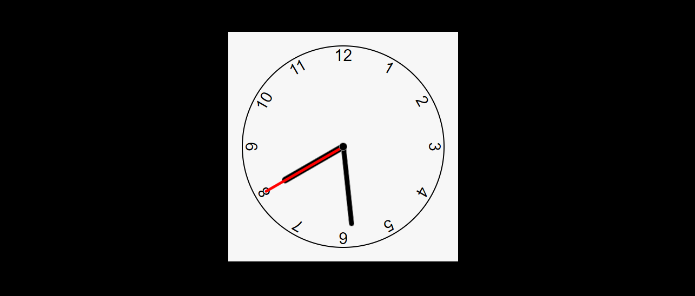

# RELOGIO VOLUME 3
😎RODE ESSE RELOGIO EM JAVASCRIPT NO SEU NAVEGADOR.

  

## DESCRIÇÃO:
Este é um relógio analógico simples que exibe a hora atual com ponteiros para horas, minutos e segundos.

1. **Elementos Visuais:** O relógio é representado por uma estrutura circular com ponteiros para horas, minutos e segundos.
2. **Ponteiros em Movimento:** Os ponteiros são atualizados a cada segundo para refletir a hora atual.
3. **Marcações de Hora:** Marcações numéricas são exibidas em torno do círculo para indicar as horas.

## EXECUTANDO O PROJETO:
* Abra o arquivo `CODIGO.html` em seu navegador de preferência.
* O relógio irá começar a exibir a hora atual com os ponteiros em movimento.
* Os ponteiros e as marcações numéricas indicam as horas, minutos e segundos.

## NÃO SABE?
- Entendemos que para manipular arquivos em `HTML`, `CSS` e outras linguagens relacionadas, é necessário possuir conhecimento nessas áreas. Para auxiliar nesse aprendizado, oferecemos cursos gratuitos disponíveis:
* [CURSO DE HTML E CSS](https://github.com/VILHALVA/CURSO-DE-HTML-E-CSS)
* [CURSO DE JAVASCRIPT](https://github.com/VILHALVA/CURSO-DE-JAVASCRIPT)
* [CONFIRA MAIS CURSOS](https://github.com/VILHALVA?tab=repositories&q=+topic:CURSO)

## CREDITOS:
- [PROJETO FEITO PELO "WilliamDosSantos"](https://github.com/WilliamDosSantos/Relogio-analogico-javascript)
- [PROJETO MODIFICADO E PUBLICADO PELO VILHALVA](https://github.com/VILHALVA)
- [ESTÁ DISPONIVEL NO SITE](https://vilhalva.github.io/STYLER/STYLER.html)

